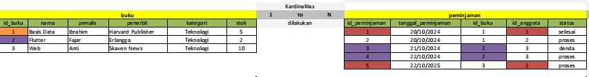
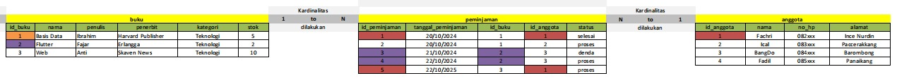

# Relasi 1-N

### Gambar ERD 1-N

### Gambar tabel 1-N

Penjelasan : 1-N (satu ke banyak)
Pada relasi 1-N ada sebuah tabel yang berelasi yaitu tabel buku dan tabel peminjam. Pada tabel buku memiliki beberapa atribut yaitu `id_buku`, `nama`, `penulis`, `penerbit`, `kategori`, dan `stok`, sedangkan pada tabel peminjaman memmiliki atribut `id_peminjaman`, `tanggal_peminjaman`, `id_buku`,  `id_anggota`, dan `status`. Pada tabel buku ke tabel peminjaman kardinalitasnya adalah 1-N. 

Satu buku bisa di pinjam oleh banyak anggota, seperti contoh pada tabel buku terdapat atribut `id_buku` yang datanya berisi id_buku `1`  `2` dan `3` nama bukunya ada `Basis data`  `Flutter` dan `Web`, sedangkan pada tabel peminjaman terdapat atribut `id_buku` yang datanya terdapat id_buku `1`, `1`, `2`, `2`,  dan `3`. Maksudnya pada tabel peminjaman ada anggota yang meminjam 1 buku secara berulang, seperti contoh id_anggota yang meminjam buku secara berulang adalah aggota `3` yang bernama `Bangdo`, yang dimana `Bangdo` ini meminjam buku Flutter 2x secara berturut-turut. Pada peminjaman pertama `Bangdo` meminjam buku `Flutter` dan transaksinya tercatat pada `id_peminjaman=3`, dan `tanggal_peminjaman=21/10/2024` serta `status=denda` dan pada peminjaman kedua `Bangdo` meminjam buku yang sama lagi yaitu `Flutter` dan pada peminjaman yang kedua kalinya transaksi `Bangdo` tercatat lagi yaitu pada `id_peminjaman=4`  dan tanggal peminjamannya pun berbeda yaitu `tanggal_peminjaman=22/10/2024` serta status yang berbeda pun yaitu `status=proses`.

Kesimpulan : 
Jadi kesimpulannya adalah satu buku `Flutter` bisa di pinjam oleh banyak anggota seperti `Bangdo` bisa meminjam buku `Flutter` secara berulang kali dan setiap peminjaman yang `Bangdo` lakukan akan tercatat transaksi baru dan `id_peminjaman` nya pun akan terus bertambah jika `Bangdo` melakukan transaksi peminjaman buku baru dan `tanggal_peminjaman` nya pun akan tercatat tanggal baru setiap kali `Bangdo` melakukan transaksi peminjaman buku baru.

### Deskripsi tabel
  Tabel Buku
 - `id_buku` = memiliki primary key yang dimana id_buku datanya unik dan tidak boleh sama.
 - `nama` = nama buku atau judul bukunya
 - `penulis` =  nama orang dari penulis buku tersebut
 - `penerbit` = nama orang dari penerbit buku tersebut
 - `kategori` =kategori buku seperti buku fiksi, umum atau teknologi
 - `stok` = jumlah stok buku tersebut

Tabel Peminjaman 
- `id_peminjaman` = memiliki primary key yang dimana datanya unik dan tidak boleh sama.
- `tanggal_peminjaman` = mencatat tanggal baru setiap peminjaman buku yang dilakukan
- `id_buku` = memiliki Foreign key yang berelasi dengan tabel buku pada atribut `id_buku`
- `id_anggota` = id_anggota yang meminjam buku
- `status` = status peminjaman buku

# Relasi N-N

### Gambar ERD N-N

### Gambar tabel N-N

Penjelasan : 
Satu atau lebih buku dapat dipinjam oleh satu atau lebih anggota. begitupun sebaliknya satu atau lebih anggota juga dapat meminjam satu atau lebih buku, Namun relasinya many-to-many. tidak bisa diterapkan secra langsung. oleh karena itulah, kita perlu membuat sebuah tabel tambahan untuk mencatat hubungan ini, yaitu tabel privot atau tabel penghubung. Jika kita tidak menggunakan tabel privot maka kita tidak bisa menangani relasi Many-to-Many. Tabel Privot ini berfungsi untuk mencatat setiap transaksi peminjaman yang menghubungkan buku dengan anggota. Setiap kali ada peminjaman, akan ada satu baris baru dalam tabel peminjaman yang menunjukkan bahwa Buku mana yang dipinjam, Siapa yang meminjam, dan Tanggal peminjaman beserta statusnya.

Anggota 1 meminjam Buku 1 pada tanggal 20/10/2024. Tabel peminjaman akan mencatat data ini dengan membuat baris baru dengan id_buku = 1 dan id_anggota = 1. Anggota 2 meminjam Buku 2 pada tanggal 20/10/2024. Ini juga akan ditambahkan sebagai baris baru di tabel peminjaman. Buku ke Peminjaman Satu buku dapat memiliki banyak catatan peminjaman, karena bisa dipinjam oleh banyak anggota dalam waktu yang berbeda-beda. Jadi satu buku bisa muncul berkali-kali dalam tabel peminjaman. Anggota ke Peminjaman Satu anggota dapat memiliki banyak catatan peminjaman, karena bisa meminjam banyak buku. Artinya, satu anggota bisa muncul berkali-kali dalam tabel peminjaman mencatat transaksi peminjaman setiap kali ada buku yang dipinjam oleh anggota.

### Deskripsi tabel
1. Relasi Buku ke Peminjaman
- Deskripsi Satu buku dapat dipinjam lebih dari sekali sehingga dapat memiliki banyak riwayat peminjaman.
- Tabel id_buku sebagai primary key di buku menjadi foreign key di peminjaman.
2. Relasi Anggota ke Peminjaman
- Deskripsi Satu anggota dapat meminjam buku beberapa kali sehingga dapat memiliki banyak riwayat peminjaman.
- Tabel id_anggota sebagai primary key di anggota menjadi foreign key di peminjaman.