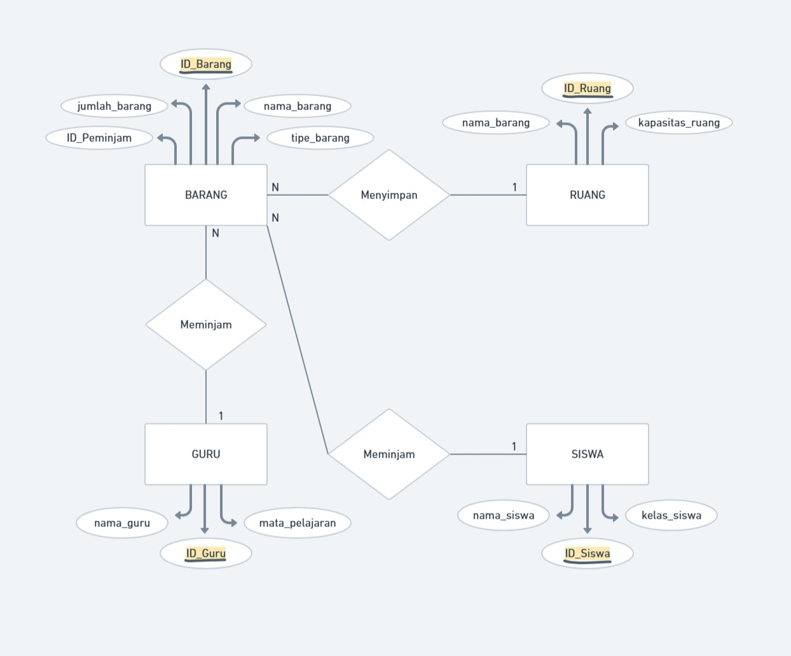

## Penjelasan Relasi
1. Barang ke Ruang
mengapa barang ke ruang bisa berelasi karena adanya nama tabel yang sama yaitu `nama_barang` yang ada pada tabel `Barang` dan tabel `Ruang`. Yang dimana jika kita menyimpan barang ke ruang kita menginput nama_barang yang ingin kita simpan di ruang.
2. Guru ke Barang
Guru berelasi ke Barang karena jika seorang guru ingin meminjam suatu barang maka akan di input siapa nama peminjam yang ingin meminjam barang. Di tabel Guru memiliki primary key yaitu `ID_Guru` dan berelasi ke tabel Barang dan memiliki kolom yang berelasi dengan guru yaitu `ID_Peminjam`.
3. Siswa ke Barang
Sama halnya dengan Guru ke barang, siswa juga berelasi dengan barang yang dimana siswa dapat meminjam banyak barang dan kolom yang berelasi itu adalah `ID_Siswa` dan `ID_peminjam` yang dimana jika siswa ingin meminjam barang maka nama siswa akan input di tabel barang pada kolom `ID_Peminjam`.

## Penjelasan Kardinalitas
1. Barang ke Ruang (N-1)
Barang `N (Many)` dan Ruang `1 (One)` yang artinya banyak barang bisa disimpan ke satu ruang seperti contoh banyaknya buku paket bisa di simpan di ruang perpustakaan dan entitas yang digunakan adalah `Menyimpan`. Adapun atribut yang menghubungkan tabel barang ke ruang adalah `ID_Barang`.
2. Guru ke Barang (N-N)
Guru `N (Many)` dan Barang `N (Many)` yang artinya banyak guru bisa meminjam banyak barang seperti contoh beberapa guru ingin meminjam buku paket lebih dari satu dan entitas yang digunakan adalah `Meminjam`. Adapun atribut yang menghubungkan tabel Guru ke Barang adalah `ID_Peminjam`.
3. Siswa ke Barang (N-N)
Siswa `N (Many)` dan Barang `N (Many)` yang artinya banyak siswa bisa meminjam banyak barang seperti contoh beberapa siswa ingin meminjam beberapa barang seperti buku, alat tulis dan entitas yang digunakan adalah `Meminjam`. Adapun atribut yang menghubungkan tabel siswa ke barang yaitu `ID_Peminjam`.