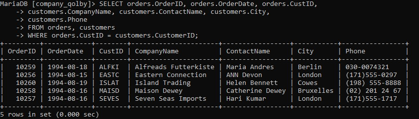
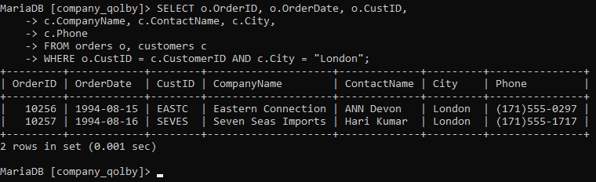
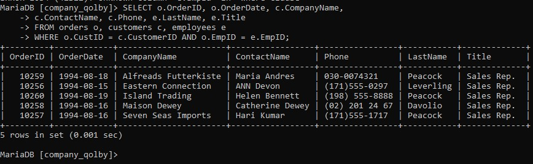
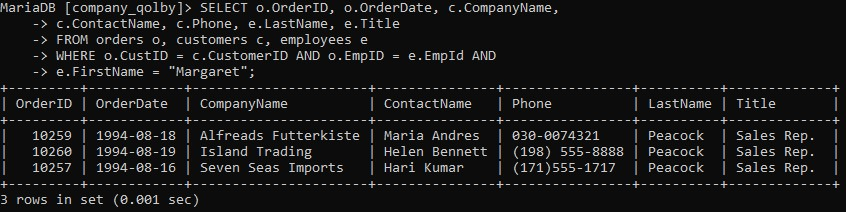
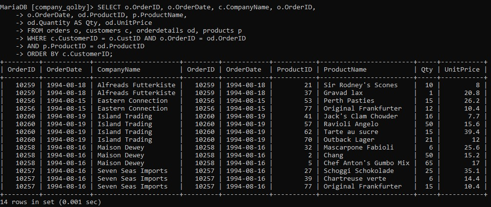
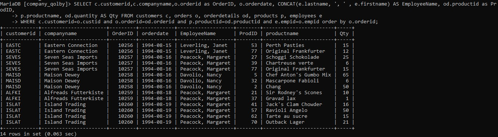
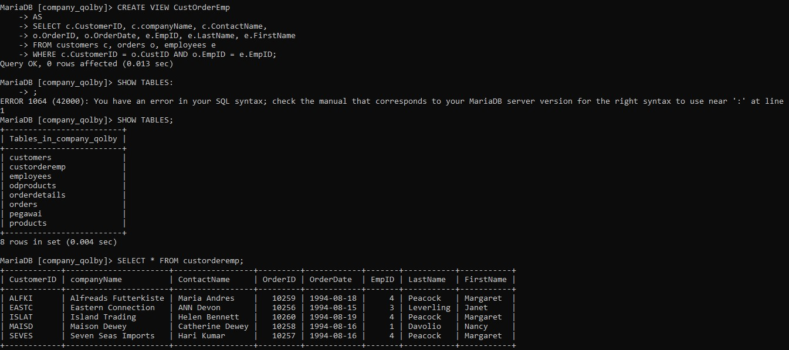
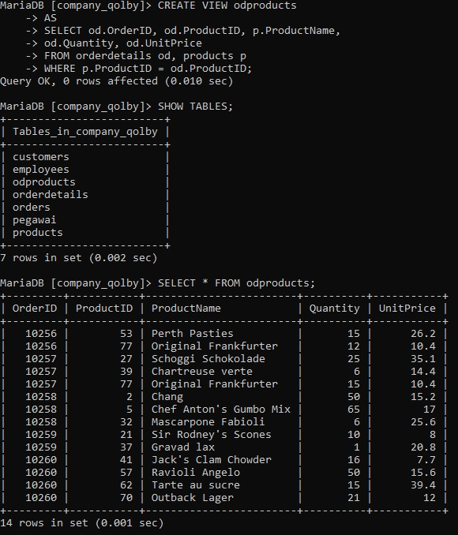
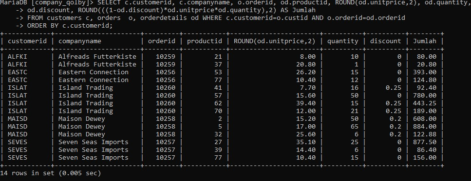
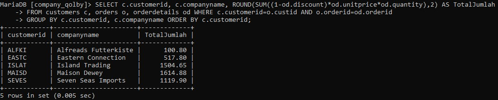

1. Gambar query 1 
  

Analisis : 
- `SELECT` : untuk memilih kolom mana saja yang ingin ditampilkan dan dari tabel mana kolom tersebut diambil.
- `orders.OrderID` : orders merupakan nama tabel yang ingin ditampilkan kolomnya yaitu `OrderID`. Jadi kolom `OrderID` pada tabel `orders` ingin ditampilkan.
- `orders.OrderDate` : kolom `OrderDate` dalam tabel `orders` ingin ditampilkan.
- `orders.CustID` : kolom `CustID` dalam tabel `orders` dipilih untuk ditampilkan.
- `customers.CompanyName` : kolom `CompanyName` dalam tabel `customers` : dipilih untuk ditampilkan.  
- `customers.ContactName` : kolom `ContactName` dalam tabel `customers` : dipilih untuk ditampilkan.
- `customers.city` : kolom `city` dalam tabel `customers` dipilih untuk ditampilkan.
- `customers.phone` : kolom `phone` dalam tabel `customers` dipilih untuk ditampilkan.
- `FROM orders, customers` : untuk memilih dari tabel mana saja yang kolomnya ingin dipilih untuk ditampilkan. `orders` adalah nama tabel pertama yang dipilih dan `customers` adalah nama tabel kedua yang dipilih.
- `WHERE` : kondisi yang harus dipenuhi oleh suatu kolom data agar bisa ditampilkan 
- `orders.custID = customers.custmersID` : kondiri dar `WHERE` yang harus dipenuhi.

2. Gambar query 2

Analisis : 
- `SELECT` : untuk memilih kolom mana saja yang ingin ditampilkan dan dari tabel mana kolom tersebut diambil.
- `o.OrderID` : `o` merupakan singkatan dari nama tabel `orders
- yang ingin ditampilkan kolomnya yaitu `OrderID`. Jadi kolom `OrderID` pada tabel `orders` ingin ditampilkan.
- `o.OrderDate` : kolom `OrderDate` dalam tabel `orders` ingin ditampilkan.
- `o.CustID` : kolom `CustID` dalam tabel `orders` dipilih untuk ditampilkan.
- `c.CompanyName` : kolom `CompanyName` dalam tabel `customers` : dipilih untuk ditampilkan.
- `c.ContactName` : kolom `ContactName` dalam tabel `customers` : dipilih untuk ditampilkan.
- `c.city` : kolom `city` dalam tabel `customers` dipilih untuk ditampilkan.
- `c.phone` : kolom `phone` dalam tabel `customers` dipilih untuk ditampilkan.
- `FROM orders o, customers c` : untuk memilih dari tabel mana saja yang kolomnya ingin dipilih untuk ditampilkan. `orders` adalah nama tabel pertama yang dipilih tapi disingkat jadi o agar lebih mudah dan cepat. dan `customers` adalah nama tabel kedua yang dipilih untuk ditampilkan tapi disingkat jadi c.
- `WHERE` : kondisi yang harus dipenuhi oleh suatu kolom data agar bisa ditampilkan 
- `orders.custID = customers.custmersID` : kondiri dar `WHERE` yang harus dipenuhi.
- `o.custID = c.cotumerID` : data pada kolom custID dalam tabel o(orders) harus sama dengan data pada kolom customerID dalam tabel c(customers)
- `AND` : untuk menyeleksi dua data atau lebih pada perintah WHERE 
- `c.city = "London"` : kondisi tambahan yang harus dipenuhi juga, jadi pada kolom city dari tabel c(customers) datanya harus berisi data "London" agar bisa ditampilkan 

3. Gambar query 3

Analisis : 
- `SELECT` : untuk memilih kolom mana saja yang ingin ditampilkan dan dari tabel mana kolom tersebut diambil.
- `o.OrderID` : `o` merupakan singkatan dari nama tabel `orders
- yang ingin ditampilkan kolomnya yaitu `OrderID`. Jadi kolom `OrderID` pada tabel `orders` ingin ditampilkan.
- `c.CompanyName` : kolom `CompanyName` dalam tabel `customers` : dipilih untuk ditampilkan.
- `c.ContactName` : kolom `ContactName` dalam tabel `customers` : dipilih untuk ditampilkan.
- `c.Phone` : kolom `CompanyPhone` dalam tabel `customers` : dipilih untuk ditampilkan.
- `e.Lastname, e.Title` : kolom lastname dan title dari tabel e(employees) dipiloh untuk ditampilkan
- `FROM orders o, customers c, employees e` : untuk memilih dari tabel mana saja yang kolomnya ingin dipilih untuk ditampilkan. `orders` adalah nama tabel pertama yang dipilih tapi disingkat jadi o agar lebih mudah dan cepat, `customers` adalah nama tabel kedua yang dipilih untuk ditampilkan tapi disingkat jadi c, dan employees nama tabel ketika yang dipilih untuk ditampilkan tapi di singkat menjadi e
- `WHERE` : kondisi yang harus dipenuhi oleh suatu kolom data agar bisa ditampilkan 
- `o.custID = c.customerID` : data pada kolom EmpID dalam tabel o(orders) harus sama dengan data pada kolom EmpID dalam tabel e(employees)

4. Gambar query 4

Analisis : 
- `SELECT` = untuk memilih kolom mana saja yang ingin ditampilkan dan dari tabel mana kolom tersebut diambil.
- `o.orderID, o.orderDate` = kolom orderID dan orderDate dari tabel o(orders) dipilih untuk ditampilkan.
- `c.companyName, c.contactName, c.Phone` = kolom companyName, contactName dan Phone dari tabel c(customers) dipilih untuk ditampilkan.
- `e.LastName, e.Title` = kolom lastName dan Title dari tabel e(employees) dipilih untuk ditampilkan.
- `FROM orders o,customers c, employees e`  = untuk memilih dari tabel mana saja yang kolomnya dipilih untuk ditampilkan. orders atau o adalah nama tabel yang dipilih untuk ditampilkan, customers atau c adalah  nama tabel yang dipilih untuk ditampilkan. employees atau e adalah nama tabel yang dipilih untuk ditampilkan. 
- `WHERE` = kondisi yang harus dipenuhi oleh suatu kolom data agar bisa ditampilkan.
- `(o.custID = c.customerID` = data pada kolom custID dalam tabel o(orders) harus sama dengan data pada kolom customerID dalam table c(customers).
- `AND` = untuk menyeleksi dua data atau lebih pada perintah WHERE.
- `(e.FirstName = "margaret")` = data pada kolom firstName dalam tabel e(employees) harus berisi data "margaret" agar bisa tampil.

HASIL : 
jadi barisan data yang sudah menenuhi  kondisi WHERE akan tampil terutama kolom firstName dari tabel employees yang isinya "margaret".

5. Gambar query 5

Analisis:
- `SELECT` = untuk memilih kolom mana saja yang ingin ditampilkan dan dari tabel mana kolom tersebut diambil.
- `c.customerID, c.companyName` = kolom customerID dan companyName dari tabel c(customers) dipilih untuk ditampilkan.
- `o.orderID, o.orderDate` = kolom orderID dan orderDate dari tabel o(orders) dipilih untuk ditampilkan.
- `od.ProductID, od.Quantity, od.UnitPrice` = kolom productID, Quantity dan UnitPrice dari table od(orderDetails) dipilih untuk ditampilkan.
- `p.ProductName` = kolom productName merupakan kolom dari tabel p(products) yang dipilih untuk ditampilkan.
- `od.Quantity AS qty` = kolom quantity ditampilkan sebagai nama sementaranya yaitu qty. AS untuk mengubah nama suatu kolom secara sementara.
- `FROM customers c, orders o, orderdetails od, product p` = untuk memilih dari tabel mana saja yang kolomnya dipilih untuk ditampilkan, customers atau c adalah nama tabel yang dipilih untuk ditampilkan. orders atau o adalah nama tabel yang dipilih untuk ditampilkan. orderdetails atau od adalah nama tabel yang dipilih untuk ditampilkan. products atau p adalah nama tabel yang dipilih untuk ditampilkan.
- `WHERE`= kondisi yang harus dipenuhi oleh suatu kolom data agar bisa ditampilkan.
- `(c.customerID = o.custID)` = data pada kolom customerID dari tabel customers atau c harus sama dengan data pada kolom custID dari tabel orders atau o.
- `AND` = untuk menyeleksi dua data atau lebih pada perintah WHERE.
- `(o.orderID =  od.orderID)` = data pada kolom orderID dari tabel orders atau o harus sama dengan data pada kolom orderID dari tabel orderdeatils atau od.
- `AND` = untuk menyeleksi dua data atau lebih pada perintah WHERE.
- `(p.productIID = od.productID)` = data pada kolom productID dari tabel products atau p harus sama dengan data pada kolom productID dari tabel orderdeatils atau od.
- `order BY c.customerID` = untuk mengurut data berdasarkan kolom customerID dari tabel customers.

HASIL : 
kolom-kolom data yang tampil adalah data yang telah memenuhi kondisi-kondisi yang ada, dan seluruh isis data tersebut diurut berdasarkan satu kolom yaitu customerID dari tabel customers.

6. Gambar query 6

Analisis:
- `SELECT` = untuk memilih kolom mana saja yang ingin ditampilkan dan digabungkan serta dari tabel mana kolom tersebut dipilih.
- `c.customerID, c.companyName` = kolom orderID dan orderDate dari tabel c(customers) dipilih untuk ditampilkan.
- `o.orderID AS ordID, o.orderDate` = kolom orderID dan orderDate dari tabel o(orders) dipilih untuk ditampilkan. sedangkan AS merupakan perintah untuk mengubah nama suatu kolom secara sementara. Dalam hal ini kolom orderID diubah namanya sementara menjadi ordID.
- `CONCAT (e.lastName, ',', e.firstName) AS EmployeeName` =  CONCAT adalah perintah untuk menggabungkan beberapa kolom data menjadi satu kolom data. (e.lastName, ',', e.firstName) merupakan kolom dari tabel e(employees) yang ingin digabung. (',') merupakan separator atau pemisah dari antara kedua kolom yang ingin digabungkan. AS EmployeeName untuk mengubah hasil CONCAT tadi menjadi EmployeeName (namanya) untuk sementara.
- `od.productID AS prodID, od.quantity AS qty` = kolom productID dan quantity dari tabel od(orderdetails) dipilih untukk ditampilkan. kolom productID namanya diubah sementara jadi prodID. kolom quantity namanya diubah sementara jadi qty.
- `p.productName` = kolom dari tabel p(products) dipilih untuk ditampilkan.
- `FROM customers c, orders o, orderdetails od, products p employees e` = untuk memilih dari tabel mana saja yang kolomnya dipilih untuk ditampilkan, customers atau c adalah nama tabel yang dipilih untuk ditampilkan. orders atau o adalah nama tabel yang dipilih untuk ditampilkan. orderdetails atau od adalah nama tabel yang dipilih untuk ditampilkan. products atau p adalah nama tabel yang dipilih untuk ditampilkan. employees atau e adalah nama tabel yang dipilih.
- `WHERE` = kondisi yang harus dipenuhi oleh suatu kolom data agar bisa ditampilkan.
- `(c.customerID = o.custID)` = data pada kolom customerID dari tabel customers atau c harus sama dengan data pada kolom custID dari tabel orders atau o.
- `AND` = untuk menyeleksi dua data atau lebih pada perintah WHERE.
- `(o.orderID = od.orderID)` = data pada kolom customerID dari tabel c(customers) harus sama dengan data pada kolom orderID dari tabel od(orderdetails).
- `AND` = untuk menyeleksi dua data atau lebih pada perintah WHERE.
- `(e.EmpID = o.EmpID)` = data pada kolom EmpID dari tabel e(Employees) harus sama dengan data pada kolom EmpID dari tabel o(orders).
- `ORDER BY o.orderID` = untuk megurut data berdasarkan kolom orderID dari tabel orders.

HASIL : 
kolom lastName dan firtsName dari tabel e(Employees) digabung dengan CONCAT dan hasil kolomnya namanya diubah sementara jadi EmployeeName.

7. Gambar query 7

Analisis:
- `CREATE VIEW custorderEmp` = merupakan tabel virtual yang dibuat dengan nama custorderEmp.
- `AS SELECT` = untuk memilih kolom-kolom mana saja yang ingin dipilih untuk dimasukkan ke tabel virtual.
- `c.CustomerID, c.CompanyName, c.ContactName` = kolom customersID, CompanyName dan ContactName dari tabel c(customers) dipilih untuk dimasukkan ke dalam tabel virtual.
- `o.orderID, o.orderDate` = kolom orderID dan orderDate dari tabel o(orders) dipilih untuk dimasukkan ke dalam tabel virtual.
- `e.EmpID, eLastName, e.FirstName` = kolom EmpID, LastName, dan FirstName dari tabel e(employees) dipilih untuk dimasukkan ke dalam tabel virtual.
- `FROM  customers c, o orders, employees e` = untuk memilih dari tabel mana saja yang kolomnya dipilih untuk dimasukkan. customers, orders, dan employees merupakan nama tabel yang kolomnya dipilih.
- `WHERE` = kondisi yang harus dipenuhi oleh suatu data agar bisa dimasukkan ke dalam tabel virtual.
- `(c.CustomerID = O.CustID)` = data pada kolom customerID dari tabel c(customers) harus sama dengan data pada kolom custID dari tabel 0(orders) agar bisa dimasukkan.
- `AND` =untuk menyeleksi dua data atau lebih pada WHERE.
- `(o.EmpID = e.EmpID)` = data pada kolom EmpID dari tabel o(orders) harus sama dengan data pada kolom EmpID dari tabel e(employees) agar bisa di masukkan.

HASIL : 
sebuah tabel virtual telah dibuat dengan nama custorderEmp yang berisi kolom-kolom dari 3 tabel customers, orders, employees dan telah memenuhi semua kondisi.

8. Gambar query 8

Analisis: 
- `CREATE VIEW odproducts` = untuk membuat tabel virtual dengan nama odproducts.
- `AS SELECT` = untuk memilih kolom-kolom mana saja yang ingin dipilih untuk dimasukkan ke tabel virtual.
- `od.orderID, od.ProductID, od.UnitPrice, od.quantity` = kolom orerID, productID, UnitPrice dan quantity dari tabel od(orderdetails) dipilih untuk dimasukkan.
- `p.productName` = kolom productName dari tabel p(product) dipilih untuk dimasukkan.
- `FROM orderdetails od, product p` = untuk memilih dari tabel mana saja yang kolomnya dipilih untuk dimasukkan. orderdetils dan products adalah nama tabel yang dipilih.
- `WHERE` = kondisi yang harus dipenuhi oleh suatu data agar bisa dimasukkan ke dalam tabel virtual.
- `(p.productID = od.productID)` = data pada kolom productID dari tabel p(product) harus sama dengan kolom productID dari tabel od(orderdetails) agar bisa dimasukkan.

HASIL : 
tabel virtual yang bernama odproducts yang terbuat dari kolom dalam 2 tabel : orderdetails dan products.

9. Gambar query 9

Analisis : 
- `SELECT` : untuk memilih koom mana saja yang ingin ditampilkan dan dihitung.
- `c.costumerID, C.companyName` : kolom costumerID dn companyName dari tabel c(costumer) dipilih untuk ditampilkan.
- `o.orderID` : kolom orderID dari tabel o (orders) dipilih untuk ditampilkan.
- `o.orderID. od.unitprice, od.quantity, od.Discount` : kolom ProductID, unitPrice, Quantity dan Discount dari tabel od(order detail) dipilih untuk ditampilkan dan dibulatkan.
- `Roun (od.unitprice, 2)` : untuk membulatkan bilangan dari kolom unitprice sampai jumlah digit tertentu, sesuai dengan pilihan yang dibuat yaitu 2

10. Gambar quey 10

Analisis:
- `SELECT` = untuk memilih kolom mana saja yang ingin ditampilkan dan dibulatkan.
- `c.customerID, c.companyName` = kolom customerID dan companyName dari tabel c(customers) dipilih untuk ditampilkan.
- `ROUND (SUM((1-od.discount) * od.unitPrice * od.quantity),2) AS Total jumlah` = untuk membulatkan hasil SUM dari ((1 dikurang kolom discount) dikali unitPrice kali quantity) sampai 2 digit. Dan nama kolom hasilnya diubah sementara jadi Total Jumlah.
- `FROM customers c, orders o, orderdetails od` = untuk memilih dari tabel mana saja yang kolomnya dipilih untuk ditampilkan dan dibulatkan. customers, orders, dan orderdetails adalah nama tabel yang dipilih.
- `WHERE` = kondisi yang harus dipenuhi oleh suatu data agar bisa ditampilkan.
- `(c.customerID = o.custID)` = data pada kolom customerID dari tabel c(customers) harus sama dengan data pada kolom custID dari tabel o(orders).
- `AND` = untuk menyeleksi dua data atau lebih pada kondisi WHERE.
- `(o.orderID = od.orderID)` = data pada kolom orderID dari tabel o(orders) harus sama dengan data pada kolom orderID dari tabel od(orderdetails).
- `GROUP BY c.customerID` = untuk mengurut data berdasarkan kolom customerID dari tabel c(customers).

HASIL : 
jadi, kolom yang dikelompokkan adalah customerID dan companyName dan tampilan datanya diurutkan berdasarkan kolom customerID.

